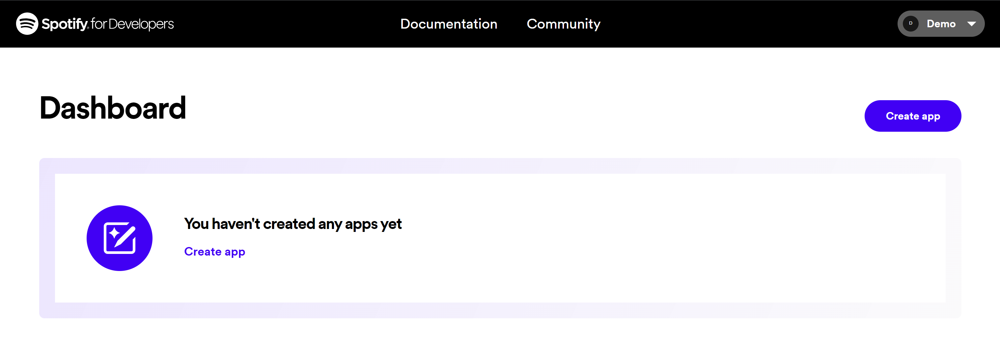
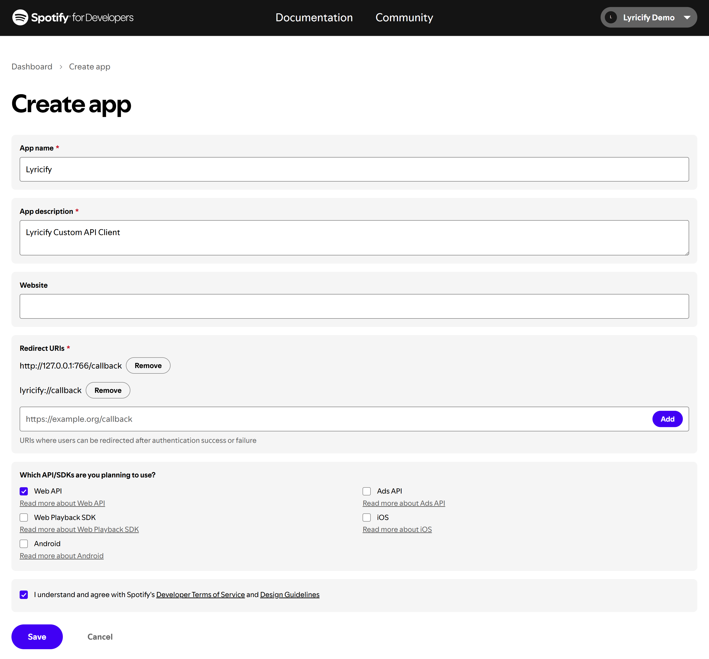
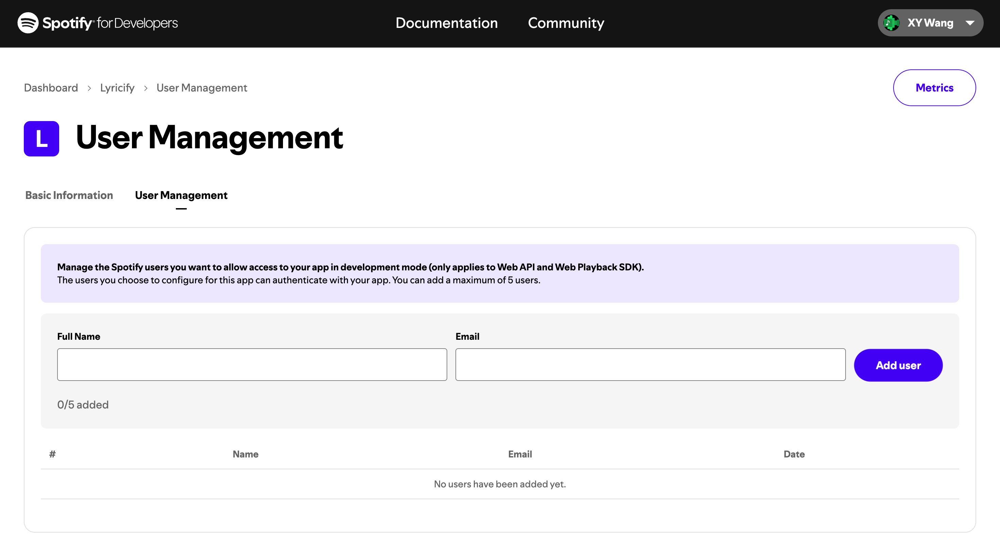

:::caution[Note]
Clients created after February 11, 2026 will cause Lyricify Mobile to malfunction and become unusable.
Please temporarily do not use newly created custom API Clients and wait for further updates.  
For any questions or feedback, please join the [Telegram group](https://t.me/lyricify).
:::

## Benefits from customising Spotify API Client
Spotify API won't affect you by returning 429 Error anymore.

## Requirements
The currently usable Custom API Client still requires Spotify Premium.  
If you do not have Spotify Premium yourself, but can borrow a usable Client created by a friend, you may also configure Lyricify in that way.  
See [Borrowing a Friend's Client Information](#borrowing-a-friends-client-information) below for details.

## Preparations
If you have already completed the preparation steps, you can directly use the previously obtained `Client ID` and `Client Secret` in `Works on Lyricify Mobile` part.
1. Login to [Spotify](https://www.spotify.com/) in your browser, if you have already logged in, go to step 2.
2. Open [Spotify Developer Dashboard](https://developer.spotify.com/dashboard), if this is your first navigation to this website, you will need to agree with Spotify Developer Terms. Just check `I accept the Spotify Developer Terms of Service` and click `Accept the terms`.

3. Click `Create app` in Dashboard's right top corner.  
   If you are prompted with `You need to verify your email address before you can create an app.`, you need to verify your email address first.

4. Fill Create app page with these:
   - App name: Lyricify
   - App description: Lyricify Custom API Client
   - Website: (Leave it empty)
   - Redirect URI:
     - http://127.0.0.1:766/callback
     - lyricify://callback
5. Check `Web API` in `Which API/SDKs are you planning to use?` section;  
   Check `I understand and agree with Spotify's Developer Terms of Service and Design Guidelines`;  
   Click `Save`.  

6. Now you can see your Client ID，Click `View client secret` to show the Client secret. `Client ID` and `Client Secret` are needed in future steps.


## Works on Lyricify Mobile
1. If you have already logged Spotify in Lyricify Mobile, then you will need to click Cancel button at open.
2. Enter `Client ID` and `Client Secret` you previously obtained in welcome page's `Custom API Client` part.
3. Click Login (Get Token), finish the login and authorization, and you are good to go.

The steps above apply when you create and configure your own Client.  
If you do not have Spotify Premium yourself, but can borrow a usable Client created by a friend, you may use the alternative method below.

## Borrowing a Friend's Client Information
If you do not have Spotify Premium yourself, but your friend does, you may use a Client created under your friend's account.  
Under Spotify's current rules, one Client can be used by up to five users.

### Actions to be completed by your friend
1. Your friend first creates the Client by following the preparation steps above.
2. Your friend opens Spotify Developer Dashboard, enters the corresponding Client, and opens the `User Management` page.
3. Your friend fills in your Spotify account information in `Full Name` and `Email`, then clicks `Add user`.

4. After that, your friend sends you the `Client ID` and `Client Secret`.

### Actions to be completed by you
1. In Lyricify Mobile, open the `Custom API Client` section by following the steps above.
2. Enter the `Client ID` and `Client Secret` provided by your friend.
3. Complete the login and authorization process.

:::note[Note]
If five users have already been added to that app, your friend must first remove one unused user before a new user can be added.
:::

# Common Issues

## Error during authorization: INVALID_CLIENT: Invalid redirect URI
Please check if the `Redirect URI` is entered correctly. Make sure it includes both `lyricify://callback` and `http://127.0.0.1:766/callback`, and **not** `https://127.0.0.1:766/callback`.  
If you're using an Android or iOS device, be sure to include `lyricify://callback` in the `Redirect URI`.  
Please ensure you are using Lyricify Mobile version 1.5.0 or later and are using `redirect to browser login`. Due to Spotify's adjustments, `embedded web login` is temporarily unavailable and will be restored in the next update.  

### Important Note
If you **created and configured your custom API Client before April 9, 2025**, please make sure to update your app settings in the Spotify Developer Dashboard. Due to recent changes in Spotify's redirect URI validation, **URIs using `localhost` are no longer accepted**. You need to replace the original:

```
http://localhost:766/callback
```

with:

```
http://127.0.0.1:766/callback
```

Open Spotify Developer Dashboard, go to the corresponding Client settings page, and add `http://127.0.0.1:766/callback` under the **Redirect URIs** section. Once updated, your custom API Client should work properly during authorization.

:::note[Note]
`127.0.0.1` is the IP address equivalent of `localhost`. Under Spotify's current validation rules, `127.0.0.1` is accepted, while `localhost` is not.
:::
