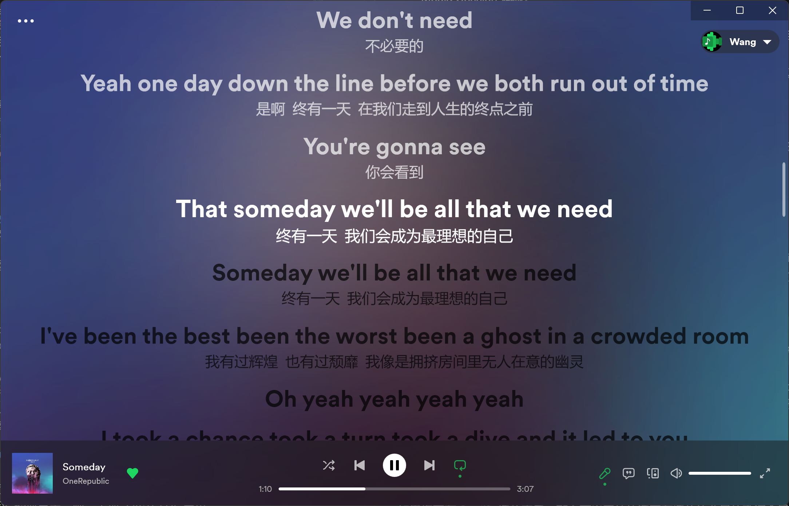
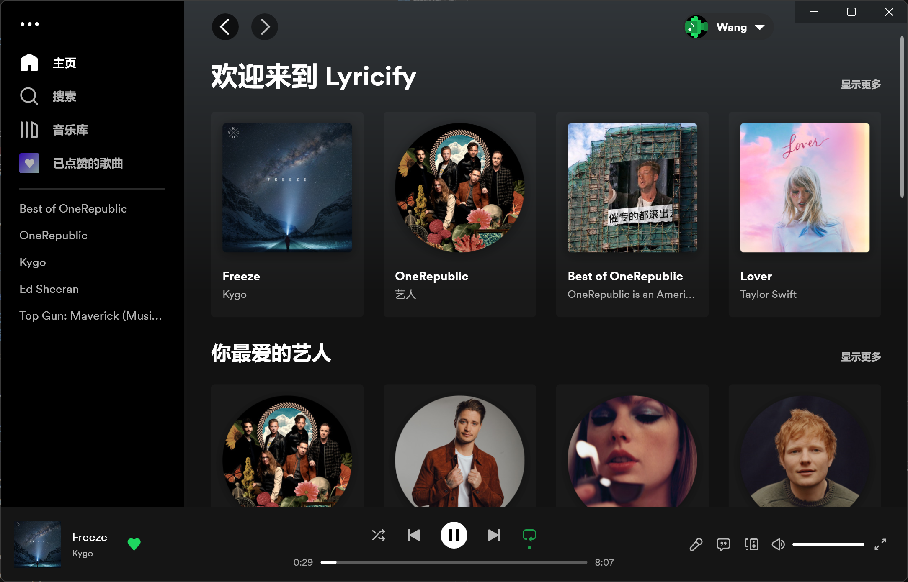

## 运行 Lyricify 4

如果您想使用 Lyricify 4，请确保您的系统中安装了 `.NET Desktop Runtime 6.0`，如果启动时提示您的未安装，则需要您在这里下载安装：  
点击下载 .NET Desktop Runtime 6.0.16 [x86](https://dotnet.microsoft.com/zh-cn/download/dotnet/thank-you/runtime-desktop-6.0.16-windows-x86-installer) [x64](https://dotnet.microsoft.com/zh-cn/download/dotnet/thank-you/runtime-desktop-6.0.16-windows-x64-installer) [Arm64](https://dotnet.microsoft.com/zh-cn/download/dotnet/thank-you/runtime-desktop-6.0.16-windows-arm64-installer)   
[点击转到 .NET 6.0 官方下载地址](https://dotnet.microsoft.com/zh-cn/download/dotnet/6.0)

## 初次使用 Lyricify 4 应了解
进入主界面的时候，如果当前没有正在播放的歌曲，请不要尝试点击播放按钮，因为这是没有作用的！！！Lyricify 是歌词软件，不是播放器，不在 Spotify 播放音乐怎么会显示歌词呢？  

### Spotify Premium 独占功能
1. Lyricify 智能引擎
2. 任意点歌（点击播放按钮，或双击歌单、专辑中的歌曲）
3. 控制播放（调整进度、播放、暂停、上一曲、下一曲、循环、随机）（免费账户在 Media Session 连接正常的情况下也可以控制播放）
4. 控制音量
5. 添加到播放列表
6. 内嵌播放必须有 Spotify Premium 订阅

## 欢迎窗口

### 基本设置
首次打开 Lyricify 4 时，会出现一些基础设置。
- **语言：** Lyricify 显示语言及 Spotify 内容语言。与 Spotify 的设置保持一致时可以获得最佳 Media Session 体验。如果您听华语偏多，建议将显示语言设置为中文，这样可以提高歌词自动搜索的准确度
- **中文翻译：** 是否在歌词有中文翻译时显示
- **颜色模式：** `深色主题` 或 `浅色主题`，在 `Lyricify 4 进阶` 中将介绍如何自行制作自定义配色主题配置
- **预设配置：** 一般情况下设置为默认即可，如果您的设备性能较差，可以设置为 `更好的性能`，如果您的设备性能很棒，则可以尝试设置为 `更好的质量`
  - *默认：* 推荐的设置
  - *更好的性能：* 关闭部分功能和特效，以保证流畅的歌词体验
  - *更好的质量：* 开启所有特效，这可能会导致在部分设备上歌词滚动时卡顿，尤其是 `Apple Music 歌词` 界面

完成上述设置后点击继续即可。

### 登录到 Spotify
Lyricify 4 仅支持 Spotify，所以您必须完成 Spotify 授权才可以正常使用 Lyricify 4。  
此步骤将自动在您的网页浏览器中打开 Spotify 授权网页，您需要做的是在该网页中完成 Spotify 的授权。完成授权后，网页会出现如下提示：
```
成功！
Spotify 授权成功。您现在可以关闭这个标签页并回到 Lyricify。
```
此时，回到 Lyricify 的欢迎界面，应该出现 `成功连接 Spotify` 的提示。如果出现 `Spotify 授权完成，请再等待几秒`，则说明 Spotify 授权已经完成，正在进行 Lyricify 服务器注册，等待几秒即可。  
最后，点击 `继续` 按钮即可开启全新 Lyricify 体验。

## Lyricify 4 主界面
如果您正在任何登录了该 Spotify 账号的设备上播放音乐，不出意外的话该曲目的歌词会显示在 Lyricify 的 `歌词` 界面。  
  
如果您没有在 Spotify 播放音乐，则会出现 `Lyricify 主页`。如果您正在 `歌词` 界面，也可以通过右下方控制区域的第一个麦克风图标来隐藏 `歌词` 界面，隐藏后将显示 `Lyricify 主页`。  
  
如果您没有正在播放的音乐，并且当前无在线的 Spotify 设备，那么点击下方的播放按钮或 `Lyricify 主页` 中的播放按钮是不会有效果的。如果您想脱离 Spotify 直接使用 Lyricify 来播放音乐，则需要配置 Lyricify 内置播放，此功能将在 `Lyricify 4 进阶` 中详细介绍。

### 按键及功能
下面是 `Lyricify 4 主界面` 中的按键及功能介绍。
- **主菜单：** 点击窗口左上角的 `···` 按钮即可打开 Lyricify 主菜单，主菜单中包含了 Lyricify 的各类功能入口和基础设置。
- **导航栏：** 左侧的导航栏提供了一些快捷方式。
  - *主页：* Lyricify 主页
  - *搜索：* Lyricify 搜索页，其中包含了 `Spotify 搜索`、`歌词搜索（暂不可用）` 和 `可用性检查`，具体介绍见后文
  - *音乐库：* Spotify 音乐库，内容与 Spotify 音乐库基本一致
  - *已点赞的歌曲：* Spotify 音乐库中的歌曲，与 Spotify 保持一致
  - *快捷访问：* 您可以在这里固定一些快捷访问项目，目前支持 `歌单`、`专辑` 和 `艺人`，您可以通过右击 `歌单` 等，点击 `固定到快捷访问` 来固定该项目。
- **用户组件：** 右上角的用户组件，包含了关于当前登录用户的信息，以及 `设置` 和 `关于` 的入口，`登出` 也需要在这里操作，如果开启了 `Media Session 增强` 功能，这里会显示 Media Session 的连接状态
- **歌曲信息区：** 左下角的歌曲信息区
  - *专辑图片：* 点击可以打开 `歌曲信息`，`音频特性` 也包含在 `歌曲信息` 中
  - *歌名：* 点击或右击歌名可显示菜单，该菜单中包含部分跳转， `曲目管理` 可以在此菜单中打开
  - *艺人：* 点击艺人即可跳转至该艺人主页
- **播放控制区：** 下方中间区域。注意：Lyricify 的控制功能需要 Spotify Premium 订阅。但在 Media Session 启用后，则可以控制 Spotify Free 账户的播放（必须是本设备上的客户端）
- **功能控制区：** 右下方的按钮区域
  - *歌词：* 麦克风按钮，点击即可打开或关闭 `歌词` 界面
  - *Apple Music 歌词：* 第二个按钮，点击即可进入 `Apple Music 歌词` 界面
  - *Spotify Connect：* 第三个按钮，点击即可管理 Spotify Connect，与 Spotify 客户端的操作类似
  - *音量控制：* 控制音量。注意：该功能需要 Spotify Premium 订阅
  - *全屏：* 点击即可进入 `Lyricify 全屏` 界面，右击可进入 `移动端 UI 全屏` 界面

### 竖屏样式
当您将窗口缩小为竖屏模式时，Lyricify 会自动调整为 `竖屏样式`，类似于 `Spotify 移动端样式`。

## 歌词操作
与 Lyricify 前三个大版本中类似，Lyricify 4 也有 `歌词标记` 功能，并在提供了更加强大的歌词管理器 `曲目管理`。

### 歌词来源
Lyricify 4 允许用户自行选择首选自动搜索词源。Lyricify 4 目前支持的自动搜索词源有：`QQ 音乐`、`网易云音乐`。  
需要注意的是，Lyricify 4 的部分特性和功能仅支持 `QQ 音乐` 歌词。例如：
- *卡拉 OK 样式：* `QQ 音乐` 歌词可以提供“真”卡拉 OK，而其他来源的歌词只能提供“假”卡拉 OK。在 `Apple Music 歌词` 界面中，仅 `QQ 音乐` 歌词支持卡拉 OK 样式
- *精确的时间轴：* 绝大部分 `QQ 音乐` 歌词可以提供更加精确的时间轴信息，从而提供更好的体验，尤其是在 `Apple Music 歌词` 界面中

此外，部分 `网易云音乐` 歌词不符合 LRC 文件的格式规范，所以在反序列化时会出错，导致歌词无法正常显示。`QQ 音乐` 歌词不规范的情况相对较少。
#### Lyricify 4 获取歌词的过程（进阶）
  1. 请求 Lyricify 4 的服务器，获取曲目的歌词信息。如果 Lyricify 4 的服务器上没有该曲目的歌词，则会进行步骤 2
  2. ~~请求 Lyricify 3 的服务器，获取曲目的歌词信息。如果 Lyricify 3 的服务器上没有该曲目的歌词，则会进行步骤 3~~ (4.0.9 及之后的版本移除了 Lyricify 3 歌词服务器支持)
  3. 自动搜索歌词，如果用户首选词源没有找到歌词，则会从备选词源获取
  4. 特殊情况：如果步骤 1 或步骤 2 中获得的歌词的来源并不是用户的首选来源，Lyricify 仍然会使用此歌词。如果需要想使用首选来源的歌词，请打开 `曲目管理` 搜索标记。在 Lyricify 歌词库中有歌词时，会直接使用，不会使用其他来源。

### 歌词标记及导入
Lyricify 4 提供 `歌词标记` 功能，您可以把自动搜索的正确歌词在服务器上标记为正确，这样做有许多好处。
- **提高歌词获取效率：** 标记后 Lyricify 将直接从 Lyricify 服务器获取歌词，而不需要再进行自动搜索的过程，自动搜索耗时约 `0.5-2s`，并且能减轻 QQ 音乐和网易云音乐服务器的负担
- **确保歌词的正确性：** 自动搜索的结果并非一直不变的，随着时间的推移，该结果可能会发生变化，甚至出现词不对曲的错误
- **保持歌词的可用性：** 部分歌曲在下架后无法被搜索到，也就无法获取歌词。标记歌词后，歌词将被上传至服务器，上传至服务器的歌词将一直可用

如果自动搜索的歌词是正确的，则可以通过以下方式快速标记：
1. 滑动到 `歌词` 界面的最下方，会显示当前歌词的来源。
2. 点击来源，在打开的菜单中点击 `标记为正确歌词` 即可完成标记。
3. 您也可以直接使用 `Shift + Alt + Q` 来快速标记。（注意：这不是全局快捷键，仅焦点在 Lyricify 主窗口时可使用）

如果自动搜索的歌词不正确，或者没有搜索到歌词，则可以手动导入：
1. 点击 `歌词` 界面中的 `手动导入 (打开曲目管理)` 按钮，进入 `曲目管理`。您还可以通过点击左下角歌名，在打开的菜单中点击 `打开曲目管理`。如果您正在 `Apple Music 歌词` 界面，则可以通过点击 `···` 圆形按钮，再点击 `打开曲目管理`。
2. 自行在 `QQ 音乐` (推荐) 或 `网易云音乐` 中找到正确的歌曲，并获取 `分享链接` 或 `Id` 或 `Mid (QQ 音乐)`。
3. 点击对应来源的 `导入` 按钮，输入上面信息。
4. 点击确定后，会显示导入的歌词信息（如果有翻译，则并不会显示翻译内容），如果歌词信息正确，请点击 `在主窗口中应用` 按钮，这时，歌词会被加载至 Lyricify 4，您需要检查歌词内容是否正常，时间轴是否正确等等。
5. 当所有信息均正确时，点击 `保存 (上传) ` 按钮，即可将您导入的正确歌词信息上传至服务器。
6. 注意：如果您打开 `曲目管理` 后发现，已经存在歌词信息（错误的），这时您仍然可以通过上述步骤覆盖已有的歌词信息。
7. 您也可以尝试先点击 `搜索` 按钮，如果点击后按钮变红，则说明没有找到歌词，如果按钮变绿，则说明找到了歌词，如果这个歌词是正确的 (`在主窗口中应用` 后检查是否正确)，您可以点击 `保存 (上传)` 按钮即可将自动搜索到的正确歌词上传 Lyricify 4 的服务器。
**在不能确保歌词是正确的情况下，请不要点击 `保存 (上传)` 按钮！**

如果该曲目在 QQ 音乐和网易云音乐均无歌词，则可以手动上传：  
具体步骤详见 [进阶教程](./advanced/)。

如果该曲目是纯音乐，则可以将其标记为纯音乐：
1. 同 `手动导入` 的步骤 1。
2. 将 `纯音乐` 复选框选为 `是`。
3. 点击 `保存 (上传) ` 按钮。

### 全局快捷键
Lyricify 4 支持全局快捷键，且支持自定义。  
您可以在 `Lyricify 主菜单` `高级` `热键管理器` 中自定义快捷键。  

| 功能 | 默认快捷键 | 默认开启 |
| :-: | :-: | :-: |
| 桌面歌词 | Alt + Shift + W | 是 |
| 灵动词岛 | Alt + Shift + D | 是 |
| 重置窗口 | Ctrl + Shift + R | 是 |
| 播放 / 暂停 | 无 | 否 |
| 上一首 | 无 | 否 |
| 下一首 | 无 | 否 |

#### 设置快捷键的方法
1. 点击右侧的快捷键文本框。
2. 按下你想设置的快捷键。
3. 如果您想为其他功能设置快捷键，请回到 `步骤 1` 继续操作；如果您已经完成所有快捷键的设置，则可以点击 `应用` 按钮。
   应用后，如果一切正常，窗口将自动关闭，不会弹出其它消息框；如果遇到问题，则会弹出提示消息框。

如果您想禁用某个快捷键，您可以按 `BackSpace` 键以删除这个快捷键。最后点击 `应用` 按钮完成设置。

## 设置

### 字体
Lyricify 4 有着强大的自定义字体功能，您可以为 `歌词` 界面、`Apple Music 歌词` 界面、`灵动词岛`、`桌面歌词`、`Lyricify 全屏` 界面 设置自定义字体。
如果您想要自定义字体，则可以通过以下步骤实现：
1. 设置中找到对应界面的 `字体家族` 设置，点击 `自定义` 按钮。
2. 这时会打开 `字体选择工具` 窗口，左侧为已安装字体列表，右侧为自定义字体列表。
3. 在左侧找到你想设置的字体，选中后点击 `添加到列表` 或直接双击该字体，即可添加至右侧自定义字体列表。
4. 点击确定即可保存。在保存之前，您可以在 `预览` 文本框中测试自定义字体效果。
5. 如果您想为中西文设置不同字体，可以自行了解 `字体回退机制`，Lyricify 4 自带的 `字体选择工具` 支持 `字体回退 (Font Fallback)`。

**如果您想使用某字体的加粗版本，您可以这样设置：**  
1. 首先在 `字体选择工具` 中设置好字体（步骤在上方）。
2. 点击设置页最下方 `设置文件` 的 `打开` 按钮。
3. 在打开的文件中找到对应的字体配置。
   - 主歌词: `window_main` `font_family`
   - 桌面歌词: `desktop_lyrics` `font_family`
   - Lyricify 全屏: `lyricify_fullscreen` `font_family`
4. 修改字体名，在字体名后加上 ` Bold`，如 `Microsoft YaHei` 修改后为 `Microsoft YaHei Bold`。

**注意：**  
1. 并非所有字体都支持这种修改为加粗版本的方式。
2. 如果有不理解的地方，您可以自行搜索和学习 `JSON 文件` 的相关知识。
