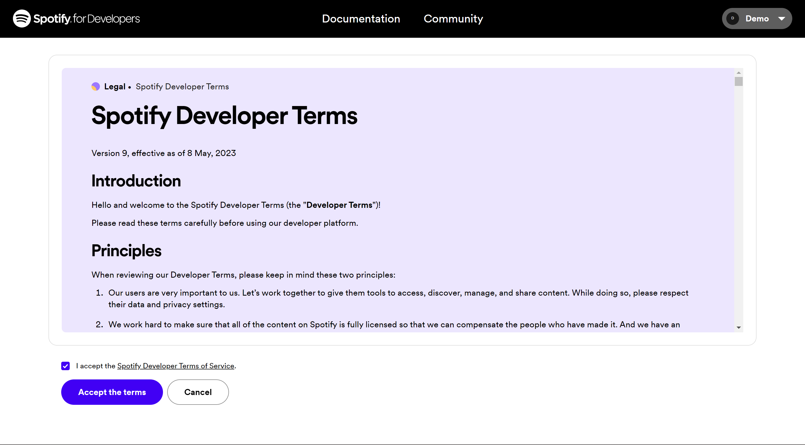
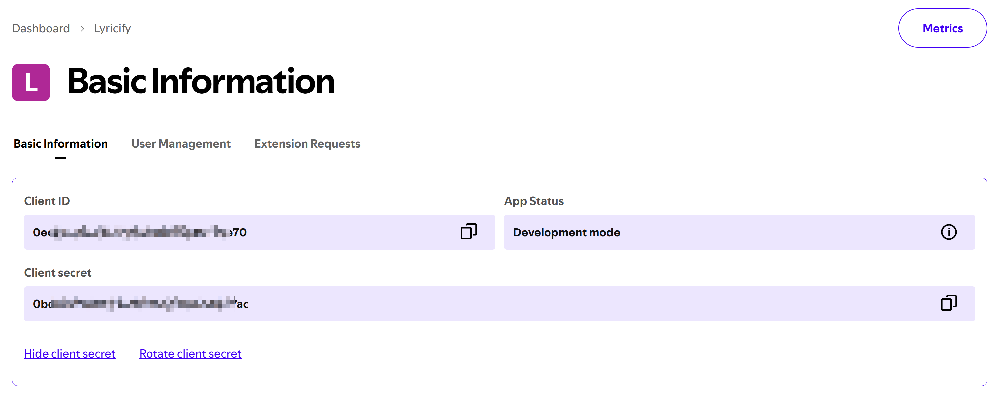

:::caution[注意]
2026 年 2 月 11 日之后创建的 Client，会导致 Lyricify Mobile 异常，无法正常使用，请暂时不要使用新创建的自定义 API Client，并等待后续进展。  
如有任何问题或反馈可加 [QQ 群](https://qm.qq.com/q/yZ6oC6fvAy)或 [Telegram 群组](https://t.me/lyricify)。
:::

## 自定义 Spotify API Client 的好处
不再会因 Spotify API 返回 429 错误而影响 Lyricify 使用体验。

## 要求
目前可用的自定义 API Client 仍需拥有 Spotify Premium 订阅。  
如果你自己没有 Spotify Premium 订阅，但可以借用朋友创建的可用 Client，也可以按该方式进行配置。  
具体操作可参见后文的 [借用朋友的 Client 信息](#借用朋友的-client-信息)。

## 准备步骤
如果你已经完成过准备步骤，则可以直接使用之前获得的 `Client ID` 和 `Client Secret`，在 `Lyricify Mobile 上的工作` 中使用。
1. 在浏览器中登录 [Spotify](https://www.spotify.com/)，如果你已登录，可进入步骤 2。
2. 打开 [Spotify Developer Dashboard](https://developer.spotify.com/dashboard)，如果你是第一次打开这个网址，则需要先同意 Spotify Developer Terms。勾选下方的 `I accept the Spotify Developer Terms of Service`，再点击 `Accept the terms` 即可。

3. 点击 Dashboard 页面右上方的 `Create app`。  
   如果提示 `You need to verify your email address before you can create an app.`，则需要你先验证你的邮箱。

4. 在 Create app 页面中填写以下信息：
   - App name: Lyricify
   - App description: Lyricify Custom API Client
   - Website: （空着不写）
   - Redirect URI: （填写以下两条，每条填写完成后点击 `Add` 按钮）
     - http://127.0.0.1:766/callback
     - lyricify://callback
5. 勾选 `Which API/SDKs are you planning to use?` 部分中的 `Web API`；  
   勾选 `I understand and agree with Spotify's Developer Terms of Service and Design Guidelines`；  
   点击 `Save` 按钮。  

6. 这时你就能看到 Client ID，点击 `View client secret`，即可显示 Client secret。在后续步骤中将需要用到 `Client ID` 和 `Client Secret`。


## Lyricify Mobile 上的工作
1. 如果你已经在 Lyricify Mobile 中登录了 Spotify，则需要在打开 Lyricify Mobile 后，进入登录界面时点击 `取消`。
2. 在欢迎界面 `自定义 API Client` 区域对应处输入准备步骤中获取到的 `Client ID` 和 `Client Secret`。
3. 点击 `登录 (获取 Token)`，重新完成登录和授权即可。

以上流程适用于自行创建 Client 的情况。  
如果你本人没有 Spotify Premium 订阅，但可以借用朋友创建的可用 Client，也可以参考下文的替代方案。

## 借用朋友的 Client 信息
如果你本人没有 Spotify Premium 订阅，但朋友拥有 Spotify Premium 订阅，也可以使用对方账户下创建的 Client。  
根据 Spotify 当前的限制，一个 Client 最多可供 5 位用户使用。

### 由对方完成的操作
1. 对方先按本文前述步骤创建好 Client。
2. 对方打开 Spotify Developer Dashboard，进入对应的 Client，并打开 `User Management` 页面。
3. 对方在 `Full Name` 和 `Email` 中填写你的 Spotify 账户信息，然后点击 `Add user`。

4. 添加完成后，对方向你提供该 Client 的 `Client ID` 和 `Client Secret`。

### 由你完成的操作
1. 在 Lyricify Mobile 中按前文步骤进入 `自定义 API Client` 区域。
2. 填入对方提供的 `Client ID` 和 `Client Secret`。
3. 继续完成登录授权。

:::note[补充说明]
如果对方的应用已经添加了 5 位用户，则需要先移除一位不再使用的用户，之后才能继续添加新的用户。
:::

# 常见问题

## 授权时提示 INVALID_CLIENT: Invalid redirect URI
请检查 `Redirect URI` 是否填写错误，确保其值包含 `lyricify://callback` 和 `http://127.0.0.1:766/callback`，而不是 `https://127.0.0.1:766/callback`。  
如果你是在 Android 或 iOS 设备上使用，请确保其值包含 `lyricify://callback`。  
请确保你使用的是 1.5.0 或更新版本的 Lyricify Mobile，且使用的是 `跳转浏览器登录`。由于 Spotify 的调整，`内嵌网页登录` 暂时无法使用，下一版本更新后将恢复。  

### 特别注意
如果你**在 2025 年 4 月 9 日前**创建并配置过自定义 API Client，请务必前往 Spotify Developer Dashboard 更新设置。由于 Spotify 调整了对重定向 URI 的要求，**原本使用 `localhost` 的 URI 已不再被接受**，你需要将原先的：

```
http://localhost:766/callback
```

替换为：

```
http://127.0.0.1:766/callback
```

请打开 Spotify Developer Dashboard，进入对应的 Client 设置页面，并在 `Redirect URI` 中添加 `http://127.0.0.1:766/callback`。完成后即可正常使用自定义 API Client 进行授权。  

:::note[注意]
`127.0.0.1` 是 `localhost` 的等效 IP 地址，在当前 Spotify 的校验机制中被视为有效地址，而 `localhost` 会被拒绝。
:::
