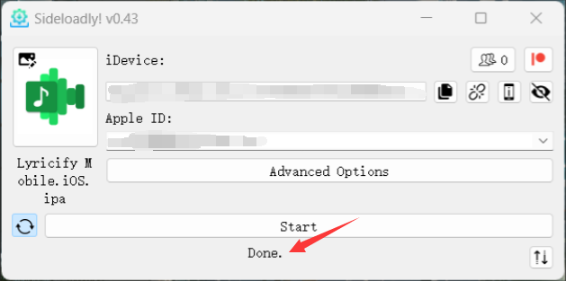
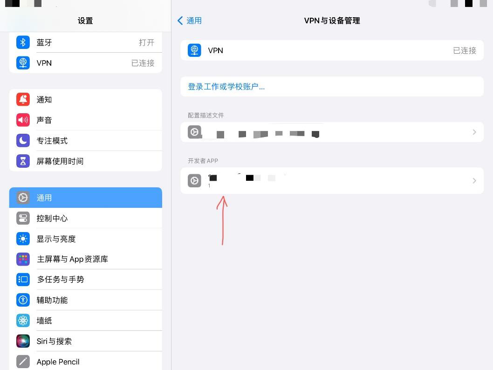
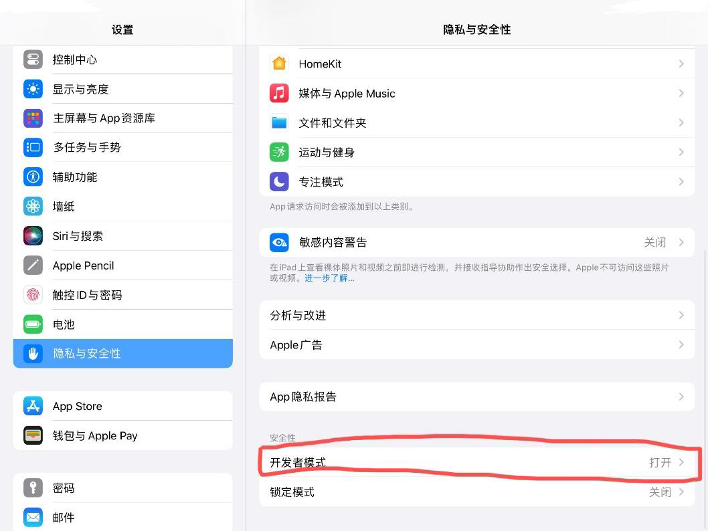
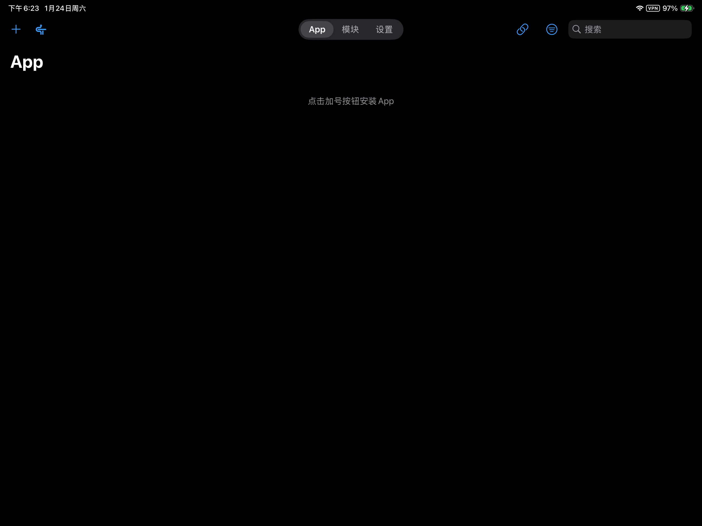

By [Tiger](https://github.com/mcuTiger), [WingChunWong](https://github.com/WingChunWong)

# iOS 安装教程

在 iOS 设备上安装未上架应用需要使用“侧载”（Sideload）工具。本教程将详细介绍两种安装方案：**Sideloadly** 和 **LiveContainer + SideStore**。

这两种方法均利用了 Apple 提供的开发者签名功能。对于未成为 Apple Developer Program 会员的用户，存在以下限制：
- 应用签名有效期为 7 天，到期后需重新续签，否则应用将无法打开。
- 单个 Apple Account 最多同时安装 3 个侧载应用。

## 准备工作

无论选择哪种方法，在开始前请确保做好以下准备：

- **硬件**：一台 macOS 或 Windows 电脑、一台 iPhone 或 iPad，请使用一根稳定的数据线，否则可能无法正确连接设备。
- **账号**：一个使用邮箱注册的 [Apple Account](https://support.apple.com/zh-cn/apple-account)。
- **安装包**：从[Github Release](https://github.com/WXRIW/Lyricify-App/releases)下载 IPA 安装包。
- 对于 Windows 用户，必须安装 [iTunes](https://www.apple.com.cn/itunes/)。

:::tip[注意]
iTunes 需要为非 Microsoft Store 版本，如果安装了 Microsoft Store 版本，请卸载并从官网下载。
:::
## 方法一：使用 Sideloadly 安装

### 步骤
1. 打开 Sideloadly，使用数据线将 iPhone / iPad 连接到你的 PC；点击 IPA 图标，载入 .ipa 文件。  
  
  注意事项：
    1. 第一次连接时，你的 iPhone / iPad 会提示是否信任此设备，选择信任即可；
    2. 连接成功后 iDevice 处会显示你的设备名称。
2. 在 Apple Account 处填写你的 Apple Account 信息；点击 Start 后，填写你的 Apple Account 密码进行验证（登录期间可能会弹出双重验证），签名成功后，程序会将 Lyricify Mobile 安装到你的设备上。  

3. 信任开发者 App；  

   然后打开你设备的开发者模式，然后重启你的 Apple 设备，并在开机后确认开启开发者模式。  

### 特别注意事项
如果在签名过程中报错（卡在步骤 2），请尝试以下方法：
1. 关掉 iTunes，从任务管理器关闭；
2. 进到 C:\ProgramData\Apple Computer\iTunes 文件夹；
3. 将 adi 文件夹更名为 adi.bak 或者直接删掉；
4. 重新打开软件进行签名即可。

#### 其他注意事项
此方法只能解锁 7 天；Start 按钮左侧的“刷新图标”建议保持开启状态（默认即开启）。这允许设备在同一 Wi-Fi 环境下每 7 天自动续签。

## 使用 LiveContainer+SideStore 安装

### 1. 安装 iloader

请根据你的操作系统下载 [iloader](https://github.com/nab138/iloader/releases/latest)。

### 2. 开启开发者模式（iOS 16+）

如果是 iOS 16 及以上系统，必须启用开发者模式才能运行侧载应用：
- 前往 `设置` -> `隐私与安全性` -> 拉到底部找到 `开发者模式` -> **开启**。
- 按提示重启设备并确认开启。

### 3. 安装 LiveContainer + SideStore
1.  启动 iloader。
2.  连接 iOS 设备至电脑，解锁并选择“信任此电脑”。
3.  登录 Apple Account。
    
4.  安装 LiveContainer+SideStore
    
5. 信任 LiveContainer。
    1. 打开 iOS `设置` -> `通用`。
    2. 向下滑动选择 `VPN 与设备管理`（旧版本系统可能显示为“描述文件与设备管理”）。
    3. 在 `开发者 APP` 下方点击你的 Apple Account。
    4. 点击 **“信任 [你的邮箱]”** 并确认。

### 4. 配置 LiveContainer & SideStore
1.  下载 [LocalDevVPN](https://apps.apple.com/hk/app/localdevvpn/id6755608044)（需要外区ID）。
2.  保持 LocalDevVPN 全程开启。
3.  打开 LiveContainer。
4.  点击左上方 SideStore 图标（首次会闪退）。
    
5.  打开 SideStore，切换到 **My Apps** 标签页。
6.  点击 `Refresh All`，输入你的 Apple Account 账户及密码。
    
7.  退出 SideStore，再次进入 LiveContainer，切换到 **设置** 标签页，点击 `从 SideStore 导入证书`。
    

### 5. 安装 Lyricify Mobile
1.  将 IPA 文件发送到手机（如通过 AirDrop 或 文件App）。
2.  如果进入了 SideStore，退出再重新进入
3.  点击左上角 **“+”**，选择 IPA 文件进行安装。

## 常见问题：不受信任的开发者

首次启动时，可能会提示`不受信任的开发者`。

**解决方法**：
1.  打开 `设置` -> `通用`。
2.  向下滑动选择 `VPN 与设备管理`（旧版本系统可能显示为“描述文件与设备管理”）。
3.  在 `开发者 APP` 下方点击你的 Apple Account。
4.  点击 **“信任 [你的邮箱]”** 并确认。

## 隐私提示
此教程不保证你的账号安全，如果按照此教程进行 App 自签造成了不可预估的安全后果，则与该教程无关，敏感信息的输入和敏感操作是你自己独立完成的。
