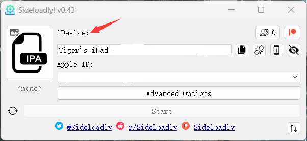
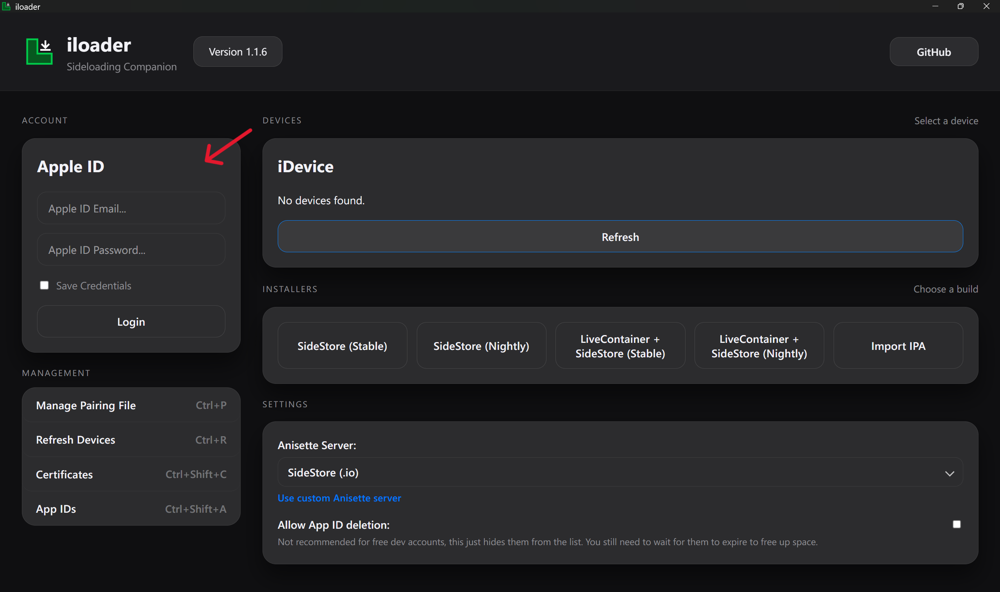
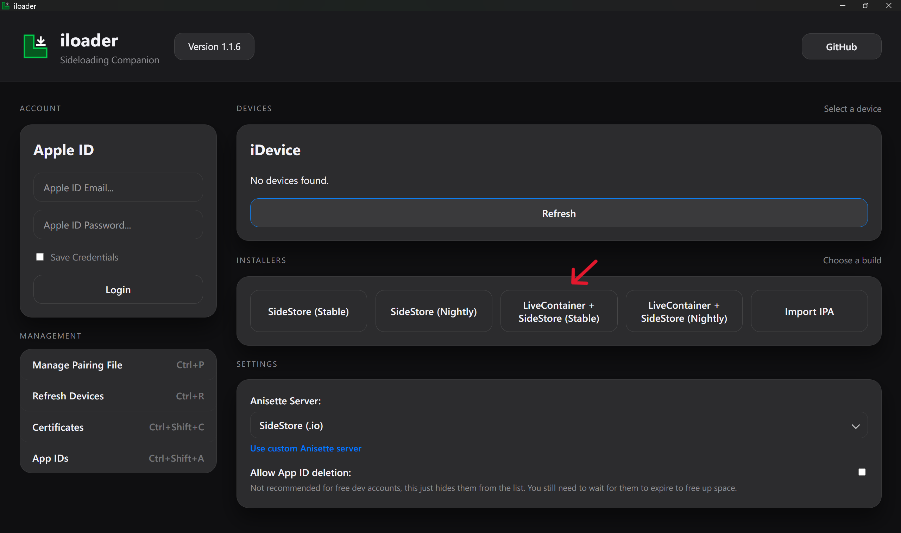
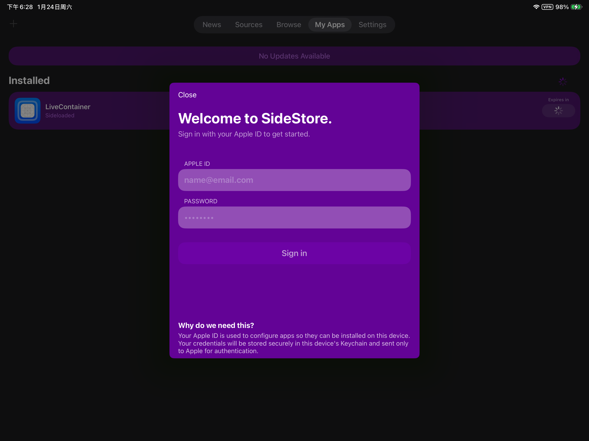
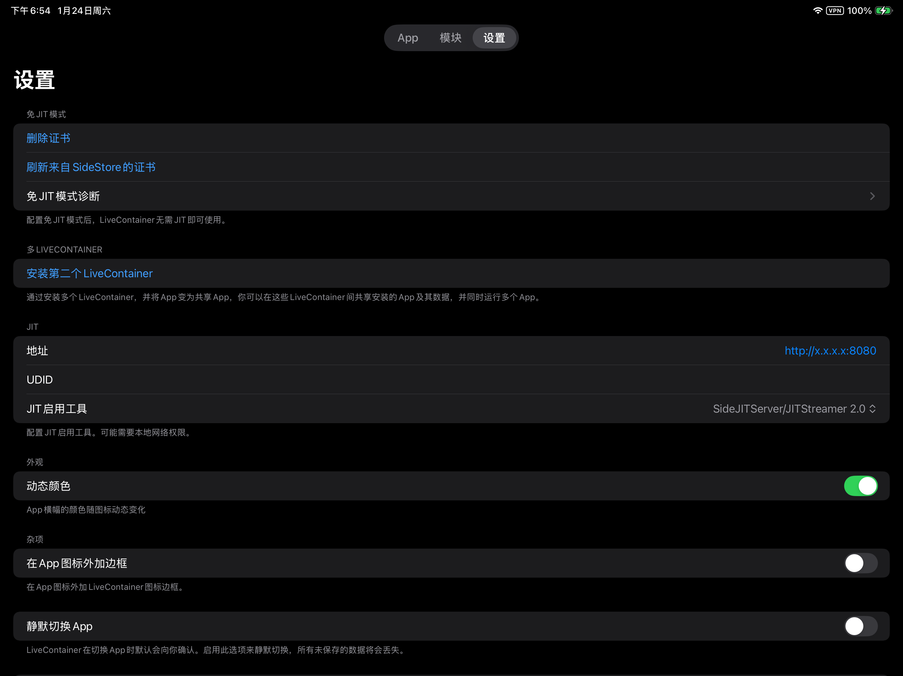

Lyricify Mobile 目前没有在 App Store 上架，因此需要通过侧载工具进行自签安装。

本文介绍两种常用方案：
- [使用 Sideloadly 安装](#方案一使用-sideloadly-安装)
- [使用 LiveContainer + SideStore 安装](#方案二使用-livecontainer--sidestore-安装)

对于非 Apple Developer Program 会员，Apple 的免费开发者签名通常有以下限制：
- 应用签名有效期为 7 天，到期后需重新续签，否则应用将无法打开。
- 单个 Apple 账户最多同时安装 3 个侧载应用。

## 开始前

无论你选择哪种方法，都建议先准备好以下内容：
- 一台 Windows PC 或 Mac。
- 一根稳定的数据线，用于连接你的 Apple 设备和电脑。
- 一个使用邮箱注册的 [Apple 账户](https://support.apple.com/zh-cn/apple-account)。
- 从 [GitHub Releases](https://github.com/WXRIW/Lyricify-App/releases) 下载的 Lyricify Mobile `.ipa` 安装包。

如果你使用 Windows PC，还需要安装 [iTunes](https://www.apple.com.cn/itunes/) 和 iCloud。

:::tip[注意]
iTunes 需要使用非 Microsoft Store 版本。如果已经安装了 Microsoft Store 版本，请先卸载，再从 Apple 官网下载安装。
:::

## 选择哪种安装方式

### 方案一：Sideloadly

适合以下情况：
- 你希望尽快完成安装。
- 你更习惯在电脑上完成整个安装流程。
- 你可以接受后续续签时偶尔连接电脑。

### 方案二：LiveContainer + SideStore

适合以下情况：
- 你已经在使用 SideStore，或愿意接受稍复杂一些的前期配置。
- 你希望后续安装和管理 `.ipa` 文件时更灵活。

## 方案一：使用 Sideloadly 安装

本部分由 [Tiger](https://github.com/mcuTiger) 编写。

### 步骤 1：连接设备并导入安装包

打开 Sideloadly，使用数据线将 iPhone / iPad 连接到电脑，点击 IPA 图标并载入 `.ipa` 文件。  

注意：
- 第一次连接时，设备会提示是否信任此电脑，选择“信任”即可。
- 连接成功后，`iDevice` 一栏会显示你的设备名称。

### 步骤 2：登录 Apple Account 并安装

在 Apple Account 处填写你的 Apple Account 信息。点击 `Start` 后，按提示输入密码并完成验证。签名成功后，Lyricify Mobile 会自动安装到你的设备上。  

登录期间可能会弹出双重验证提示，按系统提示完成即可。

### 步骤 3：信任应用并开启开发者模式

安装完成后，需要先信任开发者应用。  

随后请开启开发者模式，并按提示重启设备；重启后再次确认开发者模式已开启。  

### 签名时报错时的处理方法

如果在签名过程中卡在步骤 2，可以尝试以下方法：
1. 完全退出 iTunes，并在任务管理器中确认其相关进程已关闭。
2. 进入 `C:\ProgramData\Apple Computer\iTunes` 文件夹。
3. 将 `adi` 文件夹重命名为 `adi.bak`，或直接删除。
4. 重新打开 Sideloadly，再次尝试签名。

### 续签说明

此方法的签名有效期通常为 7 天。  
建议保持 `Start` 按钮左侧的刷新图标为开启状态，这样在 Sideloadly 运行、设备已连接且处于同一 Wi-Fi 环境时，可以自动续签。

## 方案二：使用 LiveContainer + SideStore 安装

本部分由 [WingChunWong](https://github.com/WingChunWong) 编写。

### 步骤 1：下载并安装 iloader

根据你的操作系统下载并运行 [iloader](https://github.com/nab138/iloader/releases/latest)。

### 步骤 2：开启开发者模式（iOS 16 及以上）

如果你的设备运行的是 iOS 16 或更高版本，必须先开启开发者模式：
- 打开 `设置` -> `隐私与安全性`。
- 滚动到底部，找到 `开发者模式` 并开启。
- 按提示重启设备，并在重启后确认开启。

### 步骤 3：安装 LiveContainer 和 SideStore

1. 启动 iloader。
2. 连接 iOS 设备至电脑，解锁设备并选择“信任此电脑”。
3. 登录 Apple Account。  
   
4. 安装 LiveContainer 和 SideStore。  
   
5. 在设备上信任 LiveContainer：
   1. 打开 `设置` -> `通用`。
   2. 进入 `VPN 与设备管理`（旧版本系统可能显示为“描述文件与设备管理”）。
   3. 在 `开发者 App` 下点击你的 Apple Account。
   4. 点击 **“信任 [你的邮箱]”** 并确认。

### 步骤 4：配置 LiveContainer 和 SideStore

1. 下载 [LocalDevVPN](https://apps.apple.com/hk/app/localdevvpn/id6755608044)。
2. 保持 LocalDevVPN 全程开启。
3. 打开 LiveContainer。
4. 点击左上角 SideStore 图标。首次点击时闪退属于正常现象。  
   
5. 打开 SideStore，切换到 **My Apps** 标签页。
6. 点击 `Refresh All`，输入 Apple Account 账号和密码。  
   
7. 退出 SideStore，再次进入 LiveContainer，切换到 **设置** 标签页，点击 `从 SideStore 导入证书`。  
   

### 步骤 5：安装 Lyricify Mobile

1. 将 `.ipa` 文件发送到手机，例如通过 AirDrop 或“文件”App。
2. 如果当前停留在 SideStore，请先退出，再重新进入 LiveContainer。
3. 点击左上角 **“+”**，选择 `.ipa` 文件进行安装。

## 常见问题：提示“不受信任的开发者”

首次启动时，系统可能会提示`不受信任的开发者`。

可以按以下步骤处理：
1. 打开 `设置` -> `通用`。
2. 进入 `VPN 与设备管理`（旧版本系统可能显示为“描述文件与设备管理”）。
3. 在 `开发者 App` 下点击你的 Apple Account。
4. 点击 **“信任 [你的邮箱]”** 并确认。

## 隐私提示

本教程无法保证你的账号绝对安全。如果你按照本教程进行自签安装，并因此产生不可预估的安全后果，需自行承担相应风险。涉及账号、密码等敏感信息的输入和相关操作，均由你自行完成。
